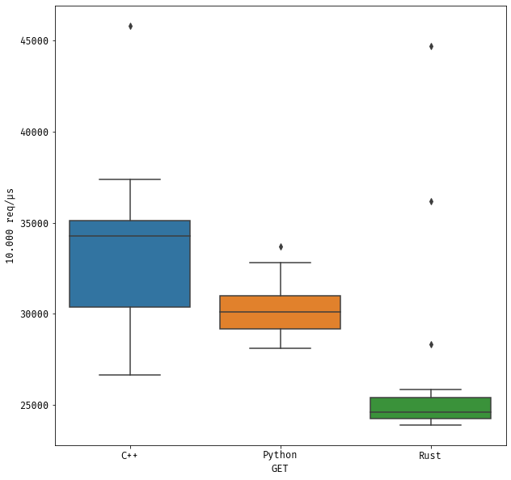
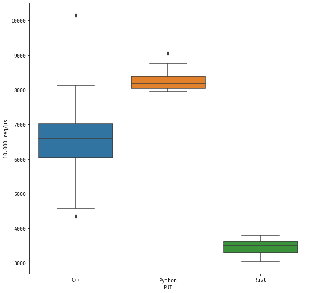
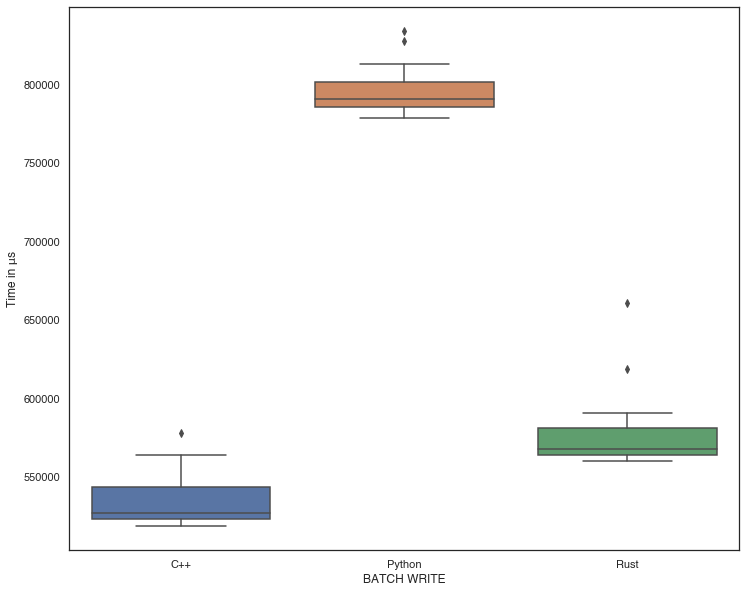

## RocksDB benchmark

This folder contains simple benchmark of C++, Python and Rust libraries.

### Results

The benchmark has been tested with 10.000 entry set and key lookup 20 times, and the charts represent results for C++, Python and Rust.

These results ran on Mac Mini M1 2020 (16 GB memory).

<p align="center">



</p>

### C++

Please use `g++` for the benchmarks. Run the following commands to run benchmark,

```bash
$ cd cpp
$ cmake -DCMAKE_CXX_COMPILER=/usr/bin/g++ .
$ make
$ ./rocksdb_bench
```

### Python

Please use Python 3.x (tested on 3.9) for the benchmark. Run the following commands to run benchmark,

```bash
$ cd src
$ python3 main.py
```

**Note**: If you need to package before the benchmark, please run,

```bash
$ cd ../..
$ maturin build --release
$ pip3 install ./target/wheels/rocksdb_py-0.0.1-cp39-cp39-macosx_11_0_arm64.whl
```

### Rust

Please use Rust 1.56 or newer version for the benchmark. Run the following commands to run benchmark,

```bash
$ cargo build --release
$ ./target/release/rocksdb-rust
```
